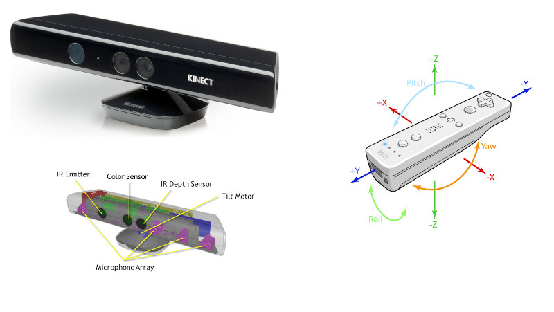
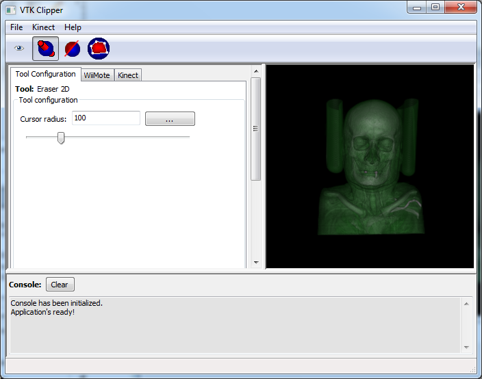
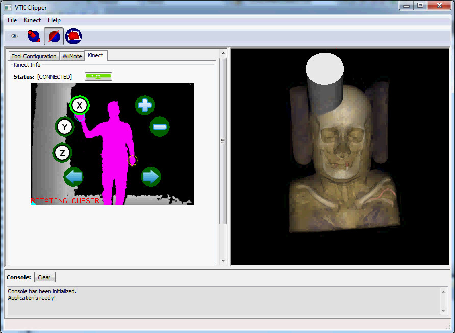
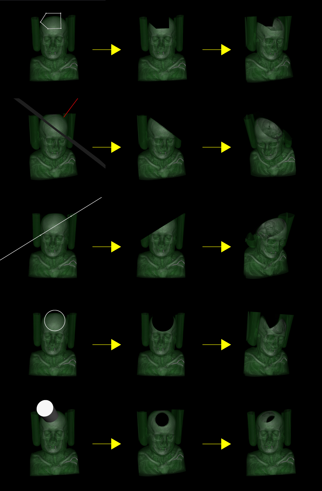
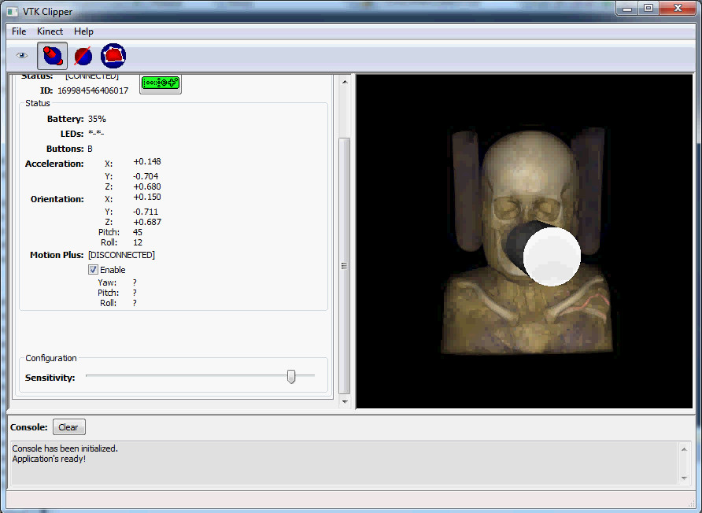

# Description

This is a Monography project implemented and presented as my **Computer Science** course conclusion project.

* **Area:** Computer Graphics & Image Processing
* **Work Title (en-US):** Volumetric Data Clipping using WiiMote and Kinect *(original title in Portuguese: Recorte de Dados Volumétricos usando WiiMote e Kinect)*.
* **Year:** 2012.
* **Institution:** Universidade Federal do Maranhão (UFMA).

This tool allows users to

* Load DICOM images originated from CT (Computerized Tomography) scans and MRT (Magnetic Resonance Tomography) exams.
* Reconstruct and visualize loaded DICOM images as volumetric data ("3D Images").
* Manipulate the loaded volumetric data via several flavors of "clipping operations", executed both with 2D and 3D operators.
* Perform image manipulations using the Nintendo Wii Remote and Microsoft Kinect input devices.

The original Monography document which originated this project can be read in [this link](https://monografias.ufma.br/jspui/bitstream/123456789/3456/1/VINICIUS-SILVA.pdf). It is currently available in Portuguese (Brazil) only.

# Screenshots

Application's main interface:

Image manipulation using Microsoft Kinect devices:

Image clipping operations examples:

Realtime Wii Remote parameter measurements:

# Technologies

The following technologies were used for building this project:

* **Main language:** C++.
* **User Interface:** [wxWidgets](https://www.wxwidgets.org/).
* **Volumetric image data manipulation:** [VTK - The Visualization Toolkit](https://vtk.org/).
* **Nintendo Wii Remote I/O:** [WiiYourself!](https://wiiyourself.gl.tter.org/).
* **Microsoft Kinect I/O:** [Microsoft NUI (Natural User Interface) APIs for Kinect](https://developer.microsoft.com/en-us/windows/kinect/).